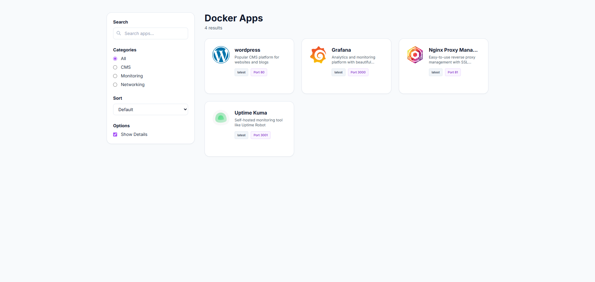
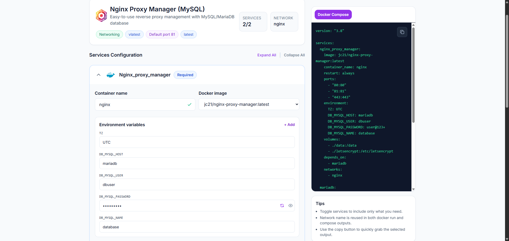
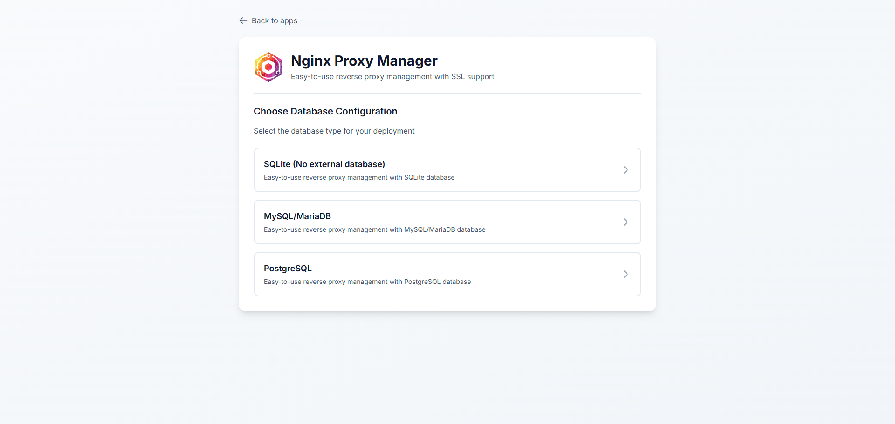
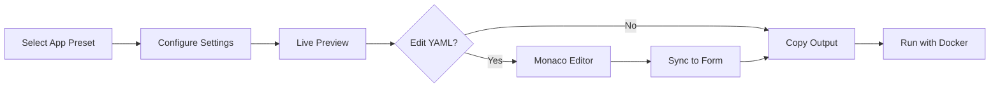

<div align="center">

# 🚢 Compose Config Studio

**Design, review, and share Docker Compose stacks with live previews and guardrails.**

[](https://github.com/nooblk-98/ComposeConfigStudio/actions)
[](https://github.com/nooblk-98/ComposeConfigStudio/releases)
[](https://github.com/nooblk-98/ComposeConfigStudio/issues)
[](LICENSE)

<br>


---

</div>

## 📖 Overview

Compose Config Studio is a **Next.js application** that helps teams design, review, and share Docker Compose stacks (and matching `docker run` commands) with **live previews**, **guardrails**, and **quick copy**. It keeps your service templates versioned, consistent, and easy to extend.

---

## 📸 Screenshots

<div align="center">

### App Selection Dashboard

*Browse and select from available application presets*

<br>

### Service Configuration Panel

*Configure ports, environment variables, volumes, and more*

<br>

### Database Configuration Selector

*Choose and configure database variants for your stack*

</div>

## ✨ Features

<table>
<tr>
<td width="50%">

### 🎯 **User-Friendly Interface**
- Browse app presets with a form-first UI
- Tweak settings without touching YAML
- Live previews for instant feedback
- Guided configuration for ports, env, volumes, and networks

</td>
<td width="50%">

### 🔄 **Real-Time Updates**
- Watch Compose YAML update instantly
- Generate matching `docker run` commands
- Edit YAML inline with Monaco Editor
- Sync changes back to the form

</td>
</tr>
<tr>
<td width="50%">

### 📦 **Template System**
- App definitions live in code (`src/data`)
- Version-controlled templates
- Support for multiple variants
- Easy to add new applications

</td>
<td width="50%">

### 🛡️ **Best Practices**
- Built-in guardrails
- Reduce copy/paste drift
- Consistent service templates
- Ready-made Compose bundles

</td>
</tr>
</table>

---

## 🚀 Quick Start

### Prerequisites
- Node.js 18+ 
- npm or yarn

### Installation

```bash
# Clone the repository
git clone https://github.com/nooblk-98/ComposeConfigStudio.git
cd ComposeConfigStudio

# Install dependencies
npm install

# Start the development server
npm run dev
```

Open [http://localhost:3000](http://localhost:3000) in your browser.

### Production Build

```bash
npm run build
npm start
```

---

## 📋 How It Works



1. **Select** an app preset from the sidebar
2. **Configure** env vars, ports, volumes, labels, networks, and variants
3. **Preview** output in real-time (Compose YAML & `docker run`)
4. **Edit** YAML directly if needed (with Monaco Editor)
5. **Copy** and run with Docker/Compose

---

## 🏗️ Tech Stack

| Category | Technologies |
|----------|-------------|
| **Framework** | Next.js 14 (App Router) |
| **Language** | TypeScript 5.0 |
| **Styling** | TailwindCSS |
| **Editor** | Monaco Editor |
| **Container** | Docker & Docker Compose |
| **Utils** | Custom generators/parsers |

---

## 📁 Project Structure

```
ComposeConfigStudio/
├── src/
│   ├── app/              # Next.js routes (UI + API)
│   │   ├── api/          # API endpoints
│   │   └── app/          # App-specific pages
│   ├── components/       # React components
│   │   ├── AppList.tsx
│   │   ├── ConfigPanel.tsx
│   │   └── OutputPanel.tsx
│   ├── data/             # App definitions & templates
│   │   ├── index.js      # App registry
│   │   ├── wordpress/    # WordPress variants
│   │   ├── nginx-proxy-manager/
│   │   └── uptime-kuma/
│   ├── types/            # TypeScript definitions
│   └── utils/            # Generators & parsers
├── docker/               # Ready-made Compose bundles
├── .github/
│   ├── workflows/        # CI/CD automation
│   └── docker/           # Example compose files
└── public/               # Static assets
```

---

## 🔧 Adding New App Templates

### 1. Register the App

Add your app to `src/data/index.js`:

```javascript
export const appsList = [
  // ... existing apps
  {
    id: 'myapp',
    name: 'My App',
    logo: '🎯',
    loader: () => import('./myapp/app.js')
  }
];
```

### 2. Create App Configuration

Create `src/data/myapp/app.js`:

```javascript
export const appDefinition = {
  name: 'My App',
  logo: '🎯',
  services: {
    myapp: {
      image: 'myapp:latest',
      ports: ['8080:8080'],
      environment: {
        APP_ENV: 'production'
      }
    }
  }
};
```

### 3. Define Types (Optional)

Update `src/types/app.ts` for custom fields:

```typescript
export interface AppDefinition {
  name: string;
  logo: string;
  services: Record<string, ServiceConfig>;
  // Add your custom fields here
}
```

---

## 📦 Ready-Made Compose Bundles

Place reusable Compose files in:
- `docker/` - User-owned bundles
- `.github/docker/` - Example bundles

Example: `docker/stack-wordpress.yml`

```yaml
services:
  wordpress:
    image: wordpress:latest
    ports:
      - "8080:80"
    environment:
      WORDPRESS_DB_HOST: db
      WORDPRESS_DB_NAME: wordpress
  db:
    image: mysql:8.0
    environment:
      MYSQL_DATABASE: wordpress
```

---

## 🔄 CI/CD & Release

### Automated Workflows

| Workflow | Purpose |
|----------|---------|
| **ci-cd.yml** | Lint, build, multi-arch image build+push, remote sync/deploy |
| **release.yml** | Auto-bump tags (SemVer), publish GitHub Releases with notes |

### Required Secrets

Ensure these secrets are configured in your repository settings:
- `PRIVATE_KEY` - SSH key for remote deployment
- Additional secrets as needed by your workflows

---

## 🤝 Contributing

We welcome contributions! Here's how you can help:

### Get Started

1. **Fork** the repository
2. **Create** a feature branch (`git checkout -b feature/amazing-feature`)
3. **Commit** your changes (`git commit -m 'Add amazing feature'`)
4. **Push** to the branch (`git push origin feature/amazing-feature`)
5. **Open** a Pull Request

### Before Submitting

```bash
# Run linting
npm run lint

# Run build to ensure no errors
npm run build
```

### What We're Looking For

- 🎨 **UI/UX improvements** - Make it more beautiful and intuitive
- 📱 **New app templates** - Add support for more applications
- 🐛 **Bug fixes** - Help squash those pesky bugs
- 📚 **Documentation** - Improve guides and examples
- ⚙️ **CI/CD enhancements** - Better automation workflows

### Pull Request Guidelines

- Include a **clear description** of changes
- Add **screenshots** for UI changes
- Keep changes **focused** and atomic
- Update **documentation** if needed

---

## 💡 Help Wanted

> **Note**: I'm not a full-stack expert! If you spot a better pattern or approach, please share it with a brief note in your PR. Open an issue if you're unsure where to start—we can scope it together.

I'm actively accepting pull requests, especially for:
- UI polish and UX improvements
- New application templates
- Performance optimizations
- Better error handling
- Test coverage

---

## 📜 License

**MIT License** - Feel free to use, modify, and distribute.

See [LICENSE](LICENSE) for details.

---

## 🎯 Purpose

Make Docker stacks easy to **author**, **review**, and **reuse** with:
- ✅ Guided UI for non-experts
- ✅ Versioned templates in code
- ✅ Live previews and validation
- ✅ Quick copy-paste workflows

---

<div align="center">

**[⭐ Star this repo](https://github.com/nooblk-98/ComposeConfigStudio)** if you find it helpful!

Made with ❤️ by the community

</div>
